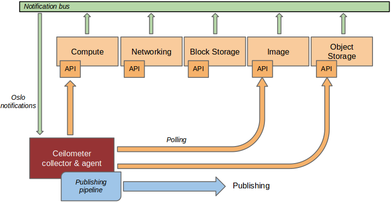
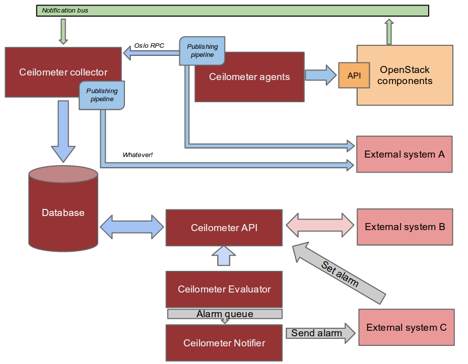

.. _architecture:

=====================
 System Architecture
=====================

High Level Description
======================

.. index::
   single: agent; architecture
   double: compute agent; architecture
   double: collector; architecture
   double: data store; architecture
   double: database; architecture
   double: API; architecture

Objectives
----------

The Ceilometer project was started in 2012 with one simple goal in mind: to
provide an infrastructure to collect any information needed regarding
OpenStack projects. It was designed so that rating engines could use this
single source to transform events into billable items which we
label as "metering".

As the project started to come to life, collecting an
`increasing number of metrics`_ across multiple projects, the OpenStack
community started to realize that a secondary goal could be added to
Ceilometer: become a standard way to collect metric, regardless of the
purpose of the collection.  For example, Ceilometer can now publish information for
monitoring, debugging and graphing tools in addition or in parallel to the
metering backend. We labelled this effort as "multi-publisher".

.. _increasing number of metrics: http://docs.openstack.org/developer/ceilometer/measurements.html

Most recently, as the Heat project started to come to
life, it soon became clear that the OpenStack project needed a tool to watch for
variations in key values in order to trigger various reactions.
As Ceilometer already had the tooling to collect vast quantities of data, it
seemed logical to add this as an extension of the Ceilometer project, which we
tagged as "alarming".

Metering
--------

If you divide a billing process into a 3 step process as is commonly done in
the telco industry, the steps are:

1. :term:`Metering` is the process of collecting information about what,
   who, when and how much regarding anything that can be billed. The result of
   this is a collection of "tickets" (a.k.a. samples) which are ready to be
   processed in anyway you want.
2. :term:`Rating` is the process of analysing a series of tickets,
   according to business rules defined by marketing, in order to transform
   them into bill line items with a currency value.
3. :term:`Billing` is the process to assemble bill line items into a
   single per customer bill, emitting the bill to start the payment collection.

Ceilometer's initial goal was, and still is, strictly limited to step
one. This is a choice made from the beginning not to go into rating or billing,
as the variety of possibilities seemed too huge for the project to ever deliver
a solution that would fit everyone's needs, from private to public clouds. This
means that if you are looking at this project to solve your billing needs, this
is the right way to go, but certainly not the end of the road for you. Once
Ceilometer is in place on your OpenStack deployment, you will still have
quite a few things to do before you can produce a bill for your customers.
One of you first task could be: finding the right queries within the Ceilometer
API to extract the information you need for your very own rating engine.

You can of course use the same API to satisfy other needs, such as a data mining
solution to help you identify unexpected or new usage types, or a capacity
planning solution. In general, it is recommended to download the data from the API in
order to work on it in a separate database to avoid overloading the one which
should be dedicated to storing tickets. It is also often found that the
Ceilometer metering DB only keeps a couple months worth of data while data is
regularly offloaded into a long term store connected to the billing system,
but this is fully left up to the implementor.

.. note::

   We do not guarantee that we won't change the DB schema, so it is
   highly recommended to access the database through the API and not use
   direct queries.

How is data collected?
----------------------
.. The source for the 7 diagrams below can be found at: https://docs.google.com/presentation/d/1P50qO9BSAdGxRSbgHSbxLo0dKWx4HDIgjhDVa8KBR-Q/edit?usp=sharing

   This is a representation of how the collectors and agents gather data from multiple sources.

In a perfect world, each and every project that you want to instrument should
send events on the Oslo bus about anything that could be of interest to
you. Unfortunately, not all
projects have implemented this and you will often need to instrument
other tools which may not use the same bus as OpenStack has defined. To
circumvent this, the Ceilometer project created 3 independent methods to
collect data:

1. :term:`Bus listener agent` which takes events generated on the Oslo
   notification bus and transforms them into Ceilometer sample. Again this
   is the preferred method of data collection. If you are working on some
   OpenStack related project and are using the Oslo library, you are kindly
   invited to come and talk to one of the project members to learn how you
   could quickly add instrumentation for your project.
2. :term:`Push agents` which is the only solution to fetch data within projects
   which do not expose the required data in a remotely usable way. This is not
   the preferred method as it makes deployment a bit more complex having to add
   a component to each of the nodes that need to be monitored. However, we do
   prefer this compared to a polling agent method as resilience (high
   availability) will not be a problem with this method.
3. :term:`Polling agents` which is the least preferred method, that will poll
   some API or other tool to collect information at a regular interval. The main
   reason why we do not like this method is the inherent difficulty to make such
   a component be resilient.

The first method is supported by the ceilometer-collector agent, which monitors
the message queues for notifications and for metering data coming from the
"push" and "polling" agents. Methods 2 and 3 rely on a combination of the
ceilometer-central-agent/ceilometer-compute-agent and the collector.

How to access collected data?
-----------------------------

Once collected, the data is stored in a database generally, or in a simple
file if you do not care about API access and want to do the rest of the
processing elsewhere. There can be multiple types of
databases through the use of different database plugins (see the section
:ref:`which-db`). Moreover, the schema and dictionary of
this database can also evolve over time. For both reasons, we offer a REST API
that should be the only way for you to access the collected data rather than
accessing the underlying database directly. It is possible that the way
you'd like to access your data is not yet supported by the API. If you think
this is the case, please contact us with your feedback as this will certainly
lead us to improve the API.

.. figure:: ./2-accessmodel.png
   :figwidth: 100%
   :align: center
   :alt: data access model

   This is a representation of how to access data stored by Ceilometer

The :ref:`list of currently built in meters <measurements>` is
available in the developer documentation,
and it is also relatively easy to add your own (and eventually contribute it).

Ceilometer is part of OpenStack, but is not tied to OpenStack's definition of
"users" and "tenants." The "source" field of each sample refers to the authority
defining the user and tenant associated with the sample. Deployers can define
custom sources through a configuration file, and then create agents to collect
samples for new meters using those sources. This means that you can collect
data for applications running on top of OpenStack, such as a PaaS or SaaS
layer, and use the same tools for metering your entire cloud.

Moreover, end users can also :ref:`send their own application specific data <user-defined-data>` into the
database through the REST API for a various set of use cases (see the section
"Alarming" later in this article).

.. _send their own application centric data: ./webapi/v2.html#user-defined-data

.. _multi-publisher:

Multi-Publisher
---------------

.. figure:: ./3-Pipeline.png
   :figwidth: 100%
   :align: center
   :alt: Ceilometer pipeline

   The assembly of components making the Ceilometer pipeline

Publishing meters for different uses is actually a two dimensional problem.
The first variable is the frequency of publication. Typically a meter that
you publish for billing need will need to be updated every 30 min while the
same meter needed for performance tuning may be needed every 10 seconds.

The second variable is the transport. In the case of data intended for a
monitoring system, losing an update or not ensuring security
(non-repudiability) of a message is not really a problem while the same meter
will need both security and guaranteed delivery in the case of data intended
for rating and billing systems.

To solve this, the notion of multi-publisher can now be configured for each
meter within Ceilometer, allowing the same technical meter to be published
multiple times to multiple destination each potentially using a different
transport and frequency of publication. At the time of writing, two
transports have been implemented so far: the original and relatively secure
Oslo RPC queue based, and one using UDP packets.

.. figure:: ./4-Transformer.png
   :figwidth: 100%
   :align: center
   :alt: Transformer example

   Example of aggregation of multiple cpu time usage samples in a single
   cpu percentage sample

.. figure:: ./5-multi-publish.png
   :figwidth: 100%
   :align: center
   :alt: Multi-publish

   This figure shows how a sample can be published to multiple destinations.

Alarming
--------

The Alarming component of Ceilometer, first delivered in the Havana
version, allows you to set alarms based on threshold evaluation for a collection
of samples. An alarm can be set on a single meter, or on a combination. For
example, you may want to trigger an alarm when the memory consumption
reaches 70% on a given instance if the instance has been up for more than
10 min. To setup an alarm, you will call :ref:`Ceilometer's API server <alarms-api>` specifying
the alarm conditions and an action to take.

Of course, if you are not administrator of the cloud itself, you can only
set alarms on meters for your own components. Good news, you can also
:ref:`send your own meters <user-defined-data>` from within your instances,
meaning that you can trigger
alarms based on application centric data.

There can be multiple form of actions, but two have been implemented so far:

1. :term:`HTTP callback`: you provide a URL to be called whenever the alarm has been set
   off. The payload of the request contains all the details of why the alarm went
   off.
2. :term:`log`: mostly useful for debugging, stores alarms in a log file.

For more details on this, I recommend you read the blog post by
Mehdi Abaakouk `Autoscaling with Heat and Ceilometer`_. Particular attention
should be given to the section "Some notes about deploying alarming" as the
database setup (using a separate database from the one used for metering)
will be critical in all cases of production deployment.

.. _Autoscaling with Heat and Ceilometer: http://techs.enovance.com/5991/autoscaling-with-heat-and-ceilometer

.. _which-db:

Which database to use
---------------------

.. figure:: ./6-storagemodel.png
   :figwidth: 100%
   :align: center
   :alt: Storage model

   An overview of the Ceilometer storage model.

Since the beginning of the project, a plugin model has been put in place
to allow for various types of database backends to be used. However, not
all implementations are equal and, at the time of writing, MongoDB
is the recommended backend of choice because it is the most tested. Have a look
at the "choosing a database backend" section of the documentation for more
details. In short, ensure a dedicated database is used when deploying
Ceilometer as the volume of data generated can be extensive in a production
environment and will generally use a lot of I/O.

   An overall summary of Ceilometer's logical architecture.

Detailed Description
====================

.. warning::

   These details cover only the compute agent and collector, as well
   as their communication via the messaging bus. More work is needed
   before the data store and API server designs can be documented.

Plugins
-------

.. index::
   double: plugins; architecture
   single: plugins; setuptools
   single: plugins; entry points

Although we have described a list of the metrics Ceilometer should
collect, we cannot predict all of the ways deployers will want to
measure the resources their customers use. This means that Ceilometer
needs to be easy to extend and configure so it can be tuned for each
installation. A plugin system based on `setuptools entry points`_
makes it easy to add new monitors in the collector or subagents for
polling.

.. _setuptools entry points: http://pythonhosted.org/setuptools/setuptools.html#dynamic-discovery-of-services-and-plugins

Each daemon provides basic essential services in a framework to be
shared by the plugins, and the plugins do the specialized work.  As a
general rule, the plugins are asked to do as little work as
possible. This makes them more efficient as greenlets, maximizes code
reuse, and makes them simpler to implement.

Installing a plugin automatically activates it the next time the
ceilometer daemon starts. A global configuration option can be used to
disable installed plugins (for example, one or more of the "default"
set of plugins provided as part of the ceilometer package).

Plugins may require configuration options, so when the plugin is
loaded it is asked to add options to the global flags object, and the
results are made available to the plugin before it is asked to do any
work.

Rather than running and reporting errors or simply consuming cycles
for no-ops, plugins may disable themselves at runtime based on
configuration settings defined by other components (for example, the
plugin for polling libvirt does not run if it sees that the system is
configured using some other virtualization tool). The plugin is
asked once at startup, after it has been loaded and given the
configuration settings, if it should be enabled. Plugins should not
define their own flags for enabling or disabling themselves.

.. warning:: Plugin self-deactivation is not implemented, yet.

Each plugin API is defined by the namespace and an abstract base class
for the plugin instances. Plugins are not required to subclass from
the API definition class, but it is encouraged as a way to discover
API changes.

.. _polling:

Polling
-------

.. index::
   double: polling; architecture

Metering data comes from two sources: through notifications built into
the existing OpenStack components and by polling the infrastructure
(such as via libvirt). Polling for compute resources is handled by an
agent running on the compute node (where communication with the
hypervisor is more efficient).  The compute agent daemon is configured
to run one or more *pollster* plugins using the
``ceilometer.poll.compute`` namespace.  Polling for resources not tied
to the compute node is handled by the central agent.  The central
agent daemon is configured to run one or more *pollster* plugins using
the ``ceilometer.poll.central`` namespace.

The agents periodically asks each pollster for instances of
``Counter`` objects. The agent framework converts the Counters to
metering messages, which it then signs and transmits on the metering
message bus.

The pollster plugins do not communicate with the message bus directly,
unless it is necessary to do so in order to collect the information
for which they are polling.

All polling happens with the same frequency, controlled by a global
setting for the agent.

Handling Notifications
----------------------

.. index::
   double: notifications; architecture

The heart of the system are the notification daemon (agent-notification) and
the collector, which monitor the message bus for data being provided by the
pollsters via the agent as well as notification messages from other
OpenStack components such as nova, glance, neutron, and swift.

The notification daemon loads one or more *listener* plugins, using the
namespace ``ceilometer.notification``. Each plugin can listen to any topics,
but by default it will listen to ``notifications.info``.

The plugin provides a method to list the event types it wants and a callback
for processing incoming messages. The registered name of the callback is
used to enable or disable it using the pipeline of the notification daemon.
The incoming messages are filtered based on their event type value before
being passed to the callback so the plugin only receives events it has
expressed an interest in seeing. For example, a callback asking for
``compute.instance.create.end`` events under
``ceilometer.collector.compute`` would be invoked for those notification
events on the ``nova`` exchange using the ``notifications.info`` topic.

The listener plugin returns an iterable with zero or more Sample instances
based on the data in the incoming message. The collector framework code
converts the Sample instances to metering messages and publishes them on the
metering message bus. Although Ceilometer includes a default storage
solution to work with the API service, by republishing on the metering
message bus we can support installations that want to handle their own data
storage.

The Ceilometer collector daemon then receives this Sample on the bus and
stores them into a database.

Handling Metering Messages
--------------------------

The listener for metering messages also runs in the collector
daemon. It validates the incoming data and (if the signature is valid)
then writes the messages to the data store.

.. note::

   Because this listener uses ``openstack.common.rpc`` instead of
   notifications, it is implemented directly in the collector code
   instead of as a plugin.

Metering messages are signed using the hmac_ module in Python's
standard library. A shared secret value can be provided in the
ceilometer configuration settings. The messages are signed by feeding
the message key names and values into the signature generator in
sorted order. Non-string values are converted to unicode and then
encoded as UTF-8. The message signature is included in the message for
verification by the collector, and stored in the database for future
verification by consumers who access the data via the API.

.. _hmac: http://docs.python.org/library/hmac.html

RPC
---

Ceilometer uses ``openstack.common.rpc`` to cast messages from the
agent to the collector.

.. seealso::

   * http://wiki.openstack.org/EfficientMetering/ArchitectureProposalV1
   * http://wiki.openstack.org/EfficientMetering#Architecture
   * `Bug 1010037`_ : allow different polling interval for each pollster

.. _Bug 1010037: https://bugs.launchpad.net/ceilometer/+bug/1010037
