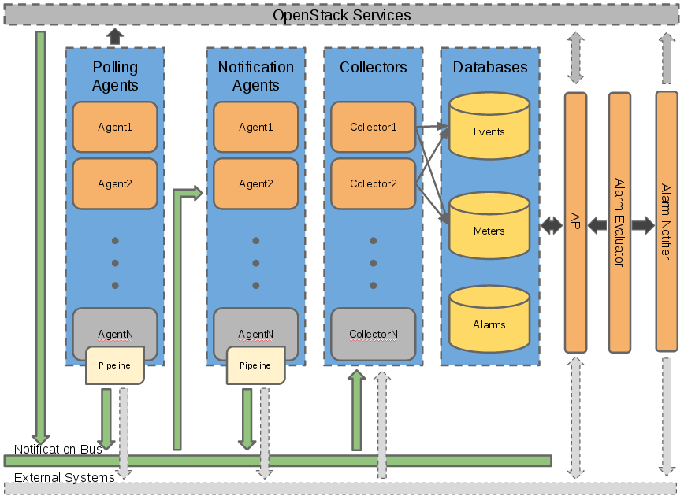
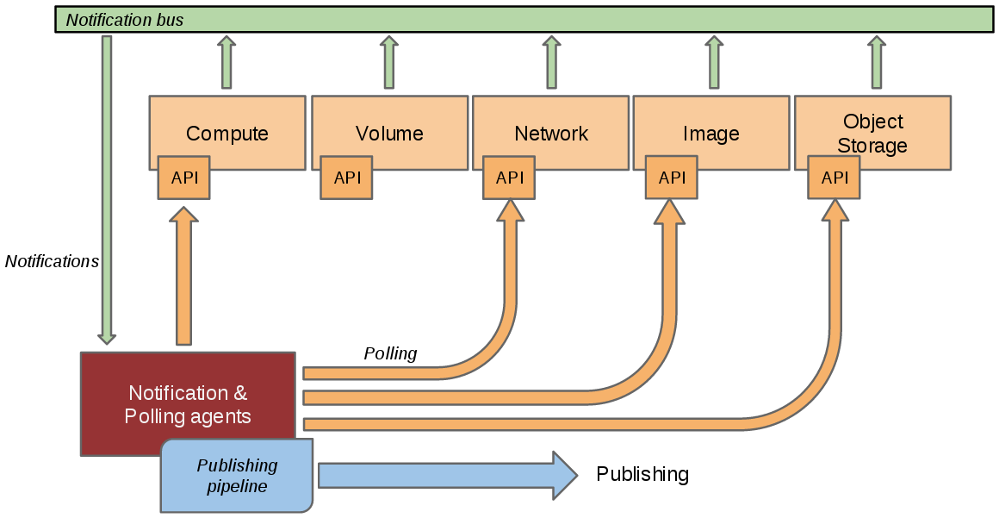
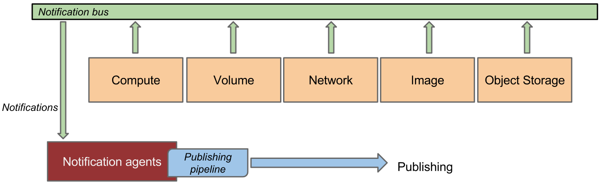
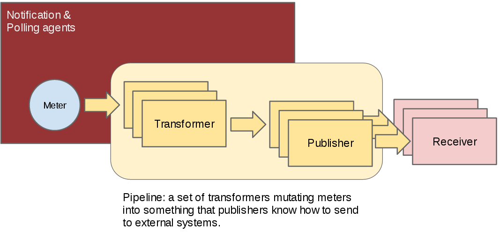
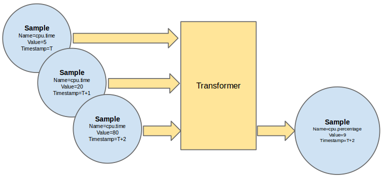
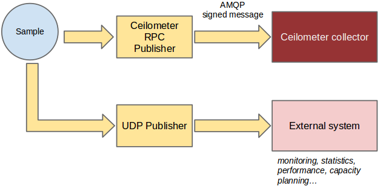
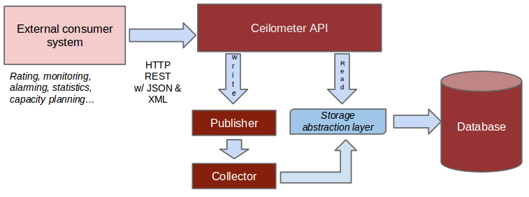

.. _architecture:

=====================
 System Architecture
=====================

.. index::
   single: agent; architecture
   double: compute agent; architecture
   double: collector; architecture
   double: data store; architecture
   double: database; architecture
   double: API; architecture

High-Level Architecture
=======================

.. The source for the following diagram can be found at: https://docs.google.com/presentation/d/1XiOiaq9zI_DIpxY1tlkysg9VAEw2r8aYob0bjG71pNg/edit?usp=sharing

   An overall summary of Ceilometer's logical architecture.

Each of Ceilometer's services are designed to scale horizontally. Additional
workers and nodes can be added depending on the expected load. Ceilometer
offers three core services, the data agents designed to work independently from
collection, but also designed to work together as a complete solution:

1. polling agent - daemon designed to poll OpenStack services and build Meters.
2. notification agent - daemon designed to listen to notifications on message queue,
   convert them to Events and Samples, and apply pipeline actions.
3. (optional) collector - daemon designed to gather and record event and metering data
   created by notification and polling agents (if using Gnocchi or full-fidelity storage).
4. (optional) api - service to query and view data recorded by collector
   in internal full-fidelity database (if enabled).

As Ceilometer has grown to capture more data, it became apparent that data
storage would need to be optimised. To address this, Gnocchi_ (resource metering
as a service) was developed to capture the data in a time series database to
optimise storage and querying. Gnocchi is intended to replace the existing
metering database interface.

.. _Gnocchi: http://docs.openstack.org/developer/gnocchi/

.. figure:: ./ceilo-gnocchi-arch.png
   :width: 100%
   :align: center
   :alt: Ceilometer+Gnocchi Architecture summary

   An overall summary of Ceilometer+Gnocchi's logical architecture.

Gathering the data
==================

How is data collected?
----------------------

   This is a representation of how the collectors and agents gather data from
   multiple sources.

In a perfect world, each and every project that you want to instrument should
send events on the Oslo bus about anything that could be of interest to
you. Unfortunately, not all projects have implemented this and you will often
need to instrument other tools which may not use the same bus as OpenStack has
defined. The Ceilometer project created 2 methods to collect data:

1. :term:`Bus listener agent` which takes events generated on the
   notification bus and transforms them into Ceilometer samples. This
   is the preferred method of data collection. If you are working on some
   OpenStack related project and are using the Oslo library, you are kindly
   invited to come and talk to one of the project members to learn how you
   could quickly add instrumentation for your project.
2. :term:`Polling agents`, which is the less preferred method, will poll
   some API or other tool to collect information at a regular interval.
   Where the option exists to gather the same data by consuming notifications,
   then the polling approach is less preferred due to the load it can impose
   on the API services.

The first method is supported by the ceilometer-notification agent, which
monitors the message queues for notifications. Polling agents can be configured
either to poll local hypervisor or remote APIs (public REST APIs exposed by
services and host-level SNMP/IPMI daemons).

Notification Agents: Listening for data
---------------------------------------

.. index::
      double: notifications; architecture

   Notification agents consuming messages from services.

The heart of the system is the notification daemon (agent-notification)
which monitors the message bus for data being provided by other
OpenStack components such as Nova, Glance, Cinder, Neutron, Swift, Keystone,
and Heat, as well as Ceilometer internal communication.

The notification daemon loads one or more *listener* plugins, using the
namespace ``ceilometer.notification``. Each plugin can listen to any topics,
but by default it will listen to ``notifications.info``. The listeners grab
messages off the defined topics and redistributes them to the appropriate
plugins(endpoints) to be processed into Events and Samples.

Sample-oriented plugins provide a method to list the event types they're interested
in and a callback for processing messages accordingly. The registered name of the
callback is used to enable or disable it using the pipeline of the notification
daemon. The incoming messages are filtered based on their event type value before
being passed to the callback so the plugin only receives events it has
expressed an interest in seeing. For example, a callback asking for
``compute.instance.create.end`` events under
``ceilometer.compute.notifications`` would be invoked for those notification
events on the ``nova`` exchange using the ``notifications.info`` topic. Event
matching can also work using wildcards e.g. ``compute.instance.*``.

Similarly, if enabled, notifications are converted into Events which can be
filtered based on event_type declared by other services.

.. _polling:

Polling Agents: Asking for data
-------------------------------

.. index::
      double: polling; architecture

.. figure:: ./2-2-collection-poll.png
   :width: 100%
   :align: center
   :alt: Polling agents

   Polling agents querying services for data.

Polling for compute resources is handled by a polling agent running
on the compute node (where communication with the hypervisor is more
efficient), often referred to as the compute-agent. Polling via
service APIs for non-compute resources is handled by an agent running
on a cloud controller node, often referred to the central-agent.
A single agent can fulfill both roles in an all-in-one deployment.
Conversely, multiple instances of an agent may be deployed, in
which case the workload is shared. The polling agent
daemon is configured to run one or more *pollster* plugins using either the
``ceilometer.poll.compute`` and/or ``ceilometer.poll.central`` namespaces.

The agents periodically ask each pollster for instances of
``Sample`` objects. The frequency of polling is controlled via the pipeline
configuration. See :ref:`Pipeline-Configuration` for details.
The agent framework then passes the samples to the
pipeline for processing.

Please notice that there's an optional config called
``shuffle_time_before_polling_task`` in ceilometer.conf. Enable this by
setting an integer greater than zero to shuffle agents to start polling task,
so as to add some random jitter to the time of sending requests to nova
or other components to avoid large number of requests in short time.
Additionally, there is an option to stream samples to minimise latency (at the
expense of load) by setting ``batch_polled_samples`` to ``False`` in ceilometer.conf.

Processing the data
===================

.. _multi-publisher:

Pipeline Manager
----------------

   The assembly of components making the Ceilometer pipeline.

Ceilometer offers the ability to take data gathered by the agents, manipulate
it, and publish it in various combinations via multiple pipelines. This
functionality is handled by the notification agents.

Transforming the data
---------------------

   Example of aggregation of multiple cpu time usage samples in a single
   cpu percentage sample.

The data gathered from the polling and notifications agents contains a wealth
of data and if combined with historical or temporal context, can be used to
derive even more data. Ceilometer offers various transformers which can be used
to manipulate data in the pipeline.

Publishing the data
-------------------

   This figure shows how a sample can be published to multiple destinations.

Currently, processed data can be published using 4 different transports:
notifier, a notification based publisher which pushes samples to a message
queue which can be consumed by the collector or an external system; udp, which
publishes samples using UDP packets; and kafka, which publishes data to a Kafka
message queue to be consumed by any system that supports Kafka.

Storing the data
================

Collector Service
-----------------

The collector daemon gathers the processed event and metering data captured by
the notification and polling agents. It validates the incoming data and (if
the signature is valid) then writes the messages to a declared target:
database, file, or http.

.. _which-db:

Supported databases
-------------------

.. figure:: ./6-storagemodel.png
   :width: 100%
   :align: center
   :alt: Storage model

   An overview of the Ceilometer storage model.

Since the beginning of the project, a plugin model has been put in place
to allow for various types of database backends to be used. A list of supported
backends can be found in the :ref:`choosing_db_backend` section of the
documentation for more details.

In the Juno and Kilo release cycle, Ceilometer's database was divided into
three separate connections: alarm, event, and metering. This allows
deployers to either continue storing all data within a single database or to
divide the data into their own databases, tailored for its purpose. For
example, a deployer could choose to store alarms in an SQL backend while
storing events and metering data in a NoSQL backend.

Ceilometer's storage service is designed to handle use cases where full-fidelity
of the data is required (e.g. auditing). To handle responsive, long-term data
queries, solutions that strip away some of the data's resolution, such as
Gnocchi, are recommended.

.. note::

   As of Liberty, alarming support, and subsequently its database, is handled
   by Aodh_.

.. note::

   We do not guarantee that we won't change the DB schema, so it is
   highly recommended to access the database through the API and not use
   direct queries.

.. _Aodh: http://docs.openstack.org/developer/aodh/

Accessing the data
==================

API Service
-----------

If the collected data from polling and notification agents are stored in Ceilometer's
database(s) (see the section :ref:`which-db`), it is possible that the schema of
these database(s) may evolve over time. For this reasons, we offer a REST API
and recommend that you access the collected data via the API rather than by
accessing the underlying database directly.

If the way in which you wish to access your data is not yet supported by the API,
please contact us with your feedback, so that we can improve the API
accordingly.

   This is a representation of how to access data stored by Ceilometer

The :ref:`list of currently built in meters <measurements>` is available in
the developer documentation, and it is also relatively easy to add your own
(and eventually contribute it).

Ceilometer is part of OpenStack, but is not tied to OpenStack's definition of
"users" and "tenants." The "source" field of each sample refers to the authority
defining the user and tenant associated with the sample. Deployers can define
custom sources through a configuration file, and then create agents to collect
samples for new meters using those sources. This means that you can collect
data for applications running on top of OpenStack, such as a PaaS or SaaS
layer, and use the same tools for metering your entire cloud.

Moreover, end users can also
:ref:`send their own application specific data <user-defined-data>` into the
database through the REST API for a various set of use cases.

.. _send their own application centric data: ./webapi/v2.html#user-defined-data
