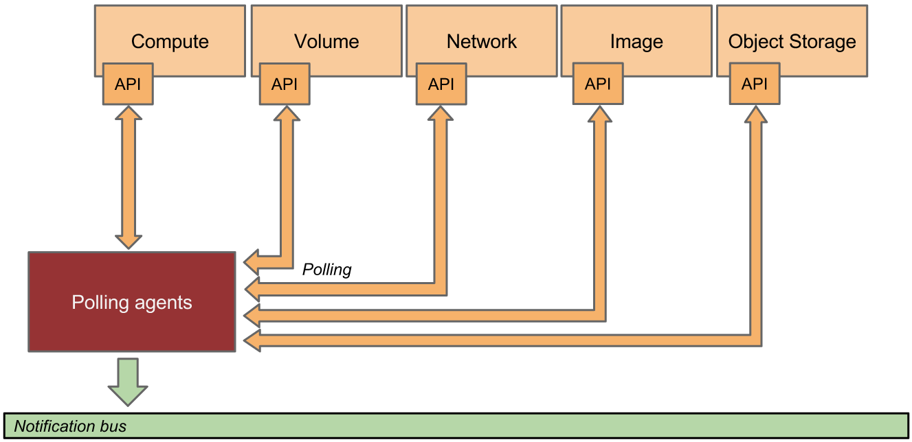
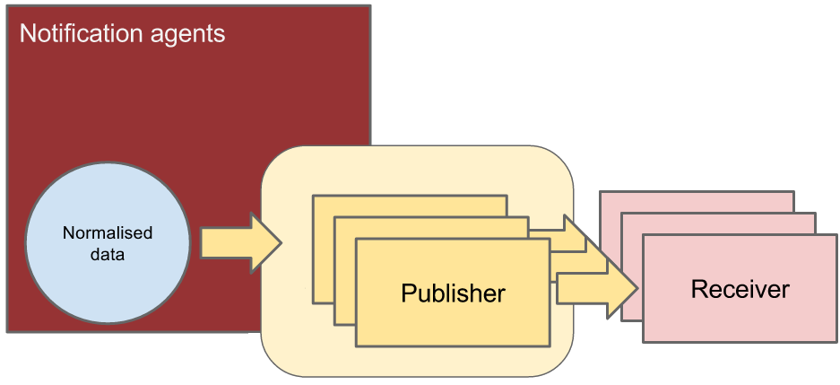

.. _architecture:

===================
System Architecture
===================

.. index::
   single: agent; architecture
   double: compute agent; architecture
   double: data store; architecture
   double: database; architecture

High-Level Architecture
=======================

.. The source for the following diagram can be found at: https://docs.google.com/presentation/d/1XiOiaq9zI_DIpxY1tlkysg9VAEw2r8aYob0bjG71pNg/edit?usp=sharing

.. figure:: ./ceilo-arch.png
   :width: 100%
   :align: center
   :alt: Architecture summary

   An overall summary of Ceilometer's logical architecture.

Each of Ceilometer's services are designed to scale horizontally. Additional
workers and nodes can be added depending on the expected load. Ceilometer
offers two core services:

1. polling agent - daemon designed to poll OpenStack services and build Meters.
2. notification agent - daemon designed to listen to notifications on message
   queue, convert them to Events and Samples, and apply pipeline actions.

Data normalised and collected by Ceilometer can be sent to various targets.
Gnocchi_ was developed to capture measurement data in a time series format to
optimise storage and querying. Gnocchi is intended to replace the existing
metering database interface. Additionally, Aodh_ is the alarming service which
can send alerts when user defined rules are broken. Lastly, Panko_ is the event
storage project designed to capture document-oriented data such as logs and
system event actions.

.. _Gnocchi: https://gnocchi.osci.io/
.. _Aodh: https://docs.openstack.org/aodh/latest/
.. _Panko: https://docs.openstack.org/panko/latest/

Gathering the data
==================

How is data collected?
----------------------

.. figure:: ./1-agents.png
   :width: 100%
   :align: center
   :alt: agents

   This is a representation of how the agents gather data from
   multiple sources.

The Ceilometer project created 2 methods to collect data:

1. :term:`notification agent` which takes messages generated on the
   notification bus and transforms them into Ceilometer samples or events.
2. :term:`polling agent`, will poll some API or other tool to collect
   information at a regular interval. The polling approach may impose
   significant on the API services so should only be used on optimised
   endpoints.

The first method is supported by the ceilometer-notification agent, which
monitors the message queues for notifications. Polling agents can be configured
either to poll the local hypervisor or remote APIs (public REST APIs exposed by
services and host-level IPMI daemons).

Notification Agent: Listening for data
---------------------------------------

.. index::
      double: notifications; architecture

.. figure:: ./2-1-collection-notification.png
   :width: 100%
   :align: center
   :alt: Notification agent

   Notification agent consuming messages from services.

The heart of the system is the notification daemon (agent-notification)
which monitors the message queue for data sent by other OpenStack
components such as Nova, Glance, Cinder, Neutron, Swift, Keystone, and Heat,
as well as Ceilometer internal communication.

The notification daemon loads one or more *listener* plugins, using the
namespace ``ceilometer.notification``. Each plugin can listen to any topic,
but by default, will listen to ``notifications.info``,
``notifications.sample``, and ``notifications.error``. The listeners grab
messages off the configured topics and redistributes them to the appropriate
plugins(endpoints) to be processed into Events and Samples.

Sample-oriented plugins provide a method to list the event types they're
interested in and a callback for processing messages accordingly.
The registered name of the callback is used to enable or disable it using
the pipeline of the notification daemon. The incoming messages are filtered
based on their event type value before being passed to the callback so the
plugin only receives events it has expressed an interest in seeing.

.. _polling:

Polling Agent: Asking for data
-------------------------------

.. index::
      double: polling; architecture

   Polling agent querying services for data.

Polling for compute resources is handled by a polling agent running
on the compute node (where communication with the hypervisor is more
efficient), often referred to as the compute-agent. Polling via
service APIs for non-compute resources is handled by an agent running
on a cloud controller node, often referred to the central-agent.
A single agent can fulfill both roles in an all-in-one deployment.
Conversely, multiple instances of an agent may be deployed, in
which case the workload is shared. The polling agent
daemon is configured to run one or more *pollster* plugins using any
combination of ``ceilometer.poll.compute``, ``ceilometer.poll.central``, and
``ceilometer.poll.ipmi`` namespaces

The frequency of polling is controlled via the polling configuration. See
:ref:`Polling-Configuration` for details. The agent framework then passes the
generated samples to the notification agent for processing.

Processing the data
===================

.. _multi-publisher:

Pipeline Manager
----------------

   The assembly of components making the Ceilometer pipeline.

Ceilometer offers the ability to take data gathered by the agents, manipulate
it, and publish it in various combinations via multiple pipelines. This
functionality is handled by the notification agents.

Publishing the data
-------------------

.. figure:: ./5-multi-publish.png
   :width: 100%
   :align: center
   :alt: Multi-publish

   This figure shows how a sample can be published to multiple destinations.

Currently, processed data can be published using different transport options:

1. gnocchi, which publishes samples/events to Gnocchi API;
2. notifier, a notification based publisher which pushes samples to a message
   queue which can be consumed by an external system;
3. udp, which publishes samples using UDP packets;
4. http, which targets a REST interface;
5. file, which publishes samples to a file with specified name and location;
6. zaqar, a multi-tenant cloud messaging and notification service for web and
   mobile developers;
7. https, which is http over SSL and targets a REST interface;
8. prometheus, which publishes samples to Prometheus Pushgateway;
9. monasca, which publishes samples to the Monasca API.

Storing/Accessing the data
==========================

Ceilometer is designed solely to generate and normalise cloud data. The data
created by Ceilometer can be pushed to any number of target using publishers
mentioned in `pipeline-publishers` section. The recommended workflow is to
push data to Gnocchi_ for efficient time-series storage and resource lifecycle
tracking.
